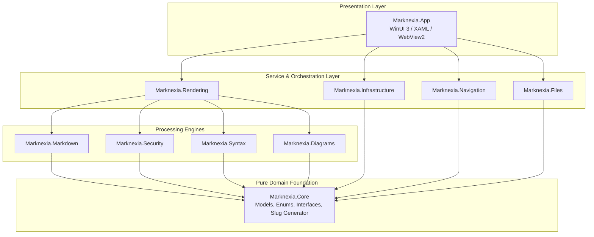

# Marknexia

<p align="center">
  
</p>

<p align="center">
  <strong>Read. Explore. Understand.</strong><br>
  <em>GitHub-style Markdown. Native on Windows.</em>
</p>

<p align="center">
  
  
  
  
  
  
</p>

---

## Overview

**Marknexia** is a high-performance, offline-first native Windows Markdown viewer and repository documentation browser. Built with **C# 13**, **.NET 10**, and **WinUI 3 (Windows App SDK)**, it faithfully reproduces GitHub-rendered Markdown semantics without cloud round-trips, web wrappers, or external CDN dependencies.

Engineered specifically for developers, technical architects, and engineering teams, Marknexia resolves the common frustrations of reading documentation repositories locally: broken relative links, non-functional repository-root `/` paths, unresponsive cross-file anchors, missing offline diagrams, and sluggish browser rendering.

---

## Key Features

### 1. 100% GitHub-Compatible Markdown (GFM)
* **GitHub Alert Callouts**: Native rendering of `[!NOTE]`, `[!TIP]`, `[!IMPORTANT]`, `[!WARNING]`, and `[!CAUTION]` blockquotes with authentic GitHub Primer iconography, colors, and border accents.
* **Deterministic Heading Anchors**: GitHub-identical heading slug generation (`#heading-title`, duplicate suffixing `-1`, `-2`, unicode handling, punctuation stripping).
* **Extended GFM Extensions**: Full support for GitHub-flavored tables, task lists with checkboxes, strikethrough, autolinks, footnotes, and custom containers.
* **Dual Theme Engine**: GitHub Light and GitHub Dark Primer token palettes that automatically adapt to your Windows system preference or user override.

### 2. Offline-First Diagrams & Math
* **Bundled Mermaid Runtime**: Pre-packaged Mermaid 11.4 engine executing locally in an isolated DOM boundary—zero network requests.
* **Rich Diagram Types**: Flowcharts, Sequence Diagrams, State Diagrams, Class Diagrams, Entity Relationship (ER) diagrams, and Gantt charts.
* **Interactive Diagram Containers**: Built-in "Copy Source" and "Toggle Source / Diagram" controls, with friendly fallback error boundaries for malformed diagram syntax.
* **Mathematical Typesetting**: Support for LaTeX / KaTeX mathematical expressions.

### 3. Resilient Repository Navigation Engine
* **Intra-Document Navigation**: Instant smooth scrolling to internal heading anchors (`#anchor-name`).
* **Relative Cross-File Links**: Seamless resolution of sibling and subfolder documents (e.g., `./docs/setup.md`, `../architecture/adr-001.md`).
* **Cross-Document Anchors**: Direct navigation across files with fragment targeting (e.g., `./api.md#authentication`).
* **Repository-Root Paths**: Absolute links prefixed with `/` (e.g., `/docs/overview.md`) automatically resolve relative to the detected repository root (`.git` boundary marker).
* **Navigation History**: Complete browser-grade `Back` and `Forward` history stacks with forward-pruning on branch navigation.
* **Directory Traversal Sandboxing**: Strict canonical path validation prevents hostile documents from escaping the workspace root (e.g., `../../../../Windows/System32`).

### 4. Modern WinUI 3 Desktop Shell
* **Multi-Document Tabs (`TabView`)**: Open, reorder, close, and navigate multiple markdown files simultaneously.
* **Hierarchical Outline Sidebar (`TreeView`)**: Real-time document outline automatically extracted from headings (`H1`–`H6`) for instant jumping.
* **Repository Workspace Explorer**: Sidebar tree view of all documentation files within the opened repository or workspace folder.
* **In-Page Search (`Ctrl+F`)**: Instant text search with match highlighting, match count indicators, and keyboard navigation (`Enter` / `Shift+Enter`).
* **Windows Shell Integration**: Native file associations for `.md`, `.markdown`, `.mdown`, and `.mkdn`.

### 5. Enterprise-Grade Security & Performance
* **Sanitized DOM Execution**: Powered by `Ganss.Xss` (`HtmlSanitizer`). Proactively strips `<script>`, `javascript:` URIs, inline DOM event handlers (`onload`, `onerror`, `onclick`), `<object>`, `<embed>`, `<iframe>`, and malicious SVGs.
* **Protocol Whitelisting**: Strict protocol restriction permitting only `file:`, `http:`, `https:`, and `mailto:`.
* **Two-Level LRU Caching**: In-memory source cache and rendered HTML document cache keyed by SHA-256 content hashes for instant tab switching.
* **Universal Encoding Detection**: Asynchronous file reader with automatic Byte Order Mark (BOM) sniffing supporting UTF-8, UTF-16 LE/BE, and UTF-32.

---

## Architecture & Layering

Marknexia enforces a strictly decoupled 10-layer architecture. Domain models, navigation logic, and parsing adapters remain pure .NET 10 libraries with **zero** UI or platform dependencies, ensuring exceptional testability and portability.



### Solution Project Directory

| Project | Responsibility | Dependencies |
| :--- | :--- | :--- |
| **`Marknexia.Core`** | Domain records (`MarkdownDocument`, `HeadingItem`, `NavigationTarget`), interfaces, and `HeadingSlugGenerator`. | Pure .NET 10 |
| **`Marknexia.Files`** | `PathCanonicalizer`, encoding-aware `FileService`, and `.git`-detecting `RepositoryService`. | `Marknexia.Core` |
| **`Marknexia.Navigation`** | `NavigationResolver` (classifications, traversal sandboxing) and `NavigationHistoryManager`. | `Marknexia.Core`, `Marknexia.Files` |
| **`Marknexia.Markdown`** | `MarkdigParserAdapter` (GFM pipeline, alerts transformation, heading extraction, Mermaid block isolation). | `Marknexia.Core`, `Markdig` |
| **`Marknexia.Syntax`** | `ColorCodeSyntaxHighlighter` (offline pure C# syntax highlighting). | `Marknexia.Core`, `ColorCode.HTML` |
| **`Marknexia.Diagrams`** | `MermaidDiagramRenderer` (DOM container wrappers, error boundaries, action triggers). | `Marknexia.Core` |
| **`Marknexia.Security`** | `HtmlSanitizerService` (Ganss.Xss sanitizer with allowlist, script and event-handler stripping). | `Marknexia.Core`, `HtmlSanitizer` |
| **`Marknexia.Rendering`** | `TemplateEngine`, `MarkdownRenderer`, embedded CSS tokens, offline Mermaid runtime, and WebView2 bridge. | `Marknexia.Core`, Engines |
| **`Marknexia.Infrastructure`** | `DocumentCache` (LRU memory cache) and `SettingsService` (JSON settings persistence). | `Marknexia.Core` |
| **`Marknexia.App`** | WinUI 3 desktop shell, XAML controls, TabView, sidebars, search bar, and MSIX packaging. | Windows App SDK, Services |

---

## Keyboard Shortcuts

| Shortcut | Action | Scope |
| :--- | :--- | :--- |
| `Ctrl + O` | Open file via system file picker | Global |
| `Ctrl + Shift + O` | Open repository / folder workspace | Global |
| `Ctrl + T` | Open new tab (default home document) | Application Shell |
| `Ctrl + W` | Close current tab | Application Shell |
| `Ctrl + Tab` | Switch to next tab | Application Shell |
| `Ctrl + Shift + Tab` | Switch to previous tab | Application Shell |
| `Ctrl + F` | Open in-page search bar | Document Viewer |
| `Enter` (in search) | Find next occurrence | Search Bar |
| `Shift + Enter` (in search) | Find previous occurrence | Search Bar |
| `Escape` (in search) | Dismiss search bar | Search Bar |
| `Alt + Left Arrow` | Navigate back in history | Document Viewer |
| `Alt + Right Arrow` | Navigate forward in history | Document Viewer |
| `Ctrl + R` / `F5` | Reload current document | Document Viewer |
| `Ctrl + K` | Quick file switcher / command palette | Application Shell |
| `Ctrl + ,` | Open Settings | Application Shell |
| `F11` | Toggle Fullscreen mode | Application Shell |

---

## Getting Started

### Prerequisites
* **Operating System**: Windows 10 version 19041 (20H1) or later, or Windows 11.
* **Developer SDK**: [.NET 10 SDK](https://dotnet.microsoft.com/download/dotnet/10.0) (10.0.100 or newer).
* **IDE / Build Tools**: Visual Studio 2022 / 2025 with the following workloads:
  * *.NET Desktop Development*
  * *Windows App SDK C# Templates*
  * (Or Visual Studio Build Tools with MSBuild and Windows 10/11 SDK).

### Cloning & Building

1. **Clone the repository**:
   ```bash
   git clone https://github.com/ramanacr/marknexia.git
   cd marknexia
   ```

2. **Restore dependencies**:
   ```bash
   dotnet restore Marknexia.slnx
   ```

3. **Build the solution**:
   ```powershell
   # Using Visual Studio MSBuild (recommended for WinUI 3 App packaging)
   & "C:\Program Files\Microsoft Visual Studio\2022\Community\MSBuild\Current\Bin\amd64\MSBuild.exe" Marknexia.slnx /p:Configuration=Debug /p:Platform=x64
   ```

4. **Run automated unit and integration tests**:
   ```bash
   dotnet test Marknexia.slnx
   ```

### Running the Application

#### Option A: Install via MSIX Package (Recommended)
Download the signed package from the [Latest Release](https://github.com/ramanacr/marknexia/releases/latest):
* **`Marknexia-v1.0.0-win-x64.msix`**
* For developer sideloading, install `Marknexia-Dev.cer` into *Trusted Root Certification Authorities* once, then double-click the `.msix` to install.

#### Option B: Portable Standalone Distribution
Download **`Marknexia-v1.0.0-win-x64.zip`**, extract anywhere, and launch `Marknexia.App.exe`.

#### Option C: Local Developer Run
To launch directly from the local build output:
```powershell
.\src\Marknexia.App\bin\Release\net10.0-windows10.0.19041.0\Marknexia.App.exe
```
Or open `Marknexia.slnx` in Visual Studio and press **F5**.

---

## Navigation & Anchor Resolution Logic

Marknexia's `NavigationResolver` categorizes and handles every link target deterministically:

| Target Link Example | Classification | Resolution Strategy |
| :--- | :--- | :--- |
| `#installation-guide` | `IntraDocumentAnchor` | In-page JavaScript scroll to element with ID `installation-guide`. |
| `./getting-started.md` | `RelativeMarkdownFile` | Resolved relative to current document directory; opens in active/new tab. |
| `../api/overview.md#auth` | `CrossDocumentAnchor` | Resolves target file path, loads document, scrolls to `#auth` on render. |
| `/docs/architecture.md` | `RepositoryRootFile` | Resolves against the `.git` root folder rather than drive root. |
| `https://github.com/` | `ExternalWeb` | Safe handoff to the user's default Windows web browser (`Process.Start`). |
| `../../../../secret.txt` | `Unsupported` (Sandbox) | Traversal attempt blocked; safe error diagnostic presented to user. |

---

## Security Model

Marknexia treats local markdown files as untrusted input. Documentation from public Git repositories could contain malicious HTML or SVG payloads:

| Attack Vector | Defense Mechanism | Implemented By |
| :--- | :--- | :--- |
| **Arbitrary JavaScript** | Strips `<script>`, `eval()`, `vbscript:`. | Ganss.Xss `HtmlSanitizerService` |
| **Inline Event Handlers** | Attributes matching `on*` (`onload`, `onerror`, `onclick`) removed. | `HtmlSanitizerService` |
| **Dangerous Schemes** | Protocols restricted to `file:`, `http:`, `https:`, `mailto:`. Blocks `javascript:`, `data:`. | `NavigationResolver` & `HtmlSanitizer` |
| **Malicious SVG Payloads** | Script elements inside inline `<svg>` blocks stripped. | `HtmlSanitizerService` |
| **Path Traversal Escapes** | `PathCanonicalizer.IsWithinRoot()` validates target paths against workspace root. | `PathCanonicalizer` |
| **Data Exfiltration** | Offline-bundled styles and scripts; zero external runtime network requests. | `MarkdownRenderer` |

---

## Automated Test Suite

Marknexia includes comprehensive unit and integration test coverage across all subsystems:

```text
Passed!  - Failed: 0, Passed:  3, Skipped: 0 - Marknexia.Core.Tests.dll
Passed!  - Failed: 0, Passed:  2, Skipped: 0 - Marknexia.Files.Tests.dll
Passed!  - Failed: 0, Passed: 25, Skipped: 0 - Marknexia.Navigation.Tests.dll
Passed!  - Failed: 0, Passed:  5, Skipped: 0 - Marknexia.Markdown.Tests.dll
Passed!  - Failed: 0, Passed:  5, Skipped: 0 - Marknexia.Security.Tests.dll
Passed!  - Failed: 0, Passed:  2, Skipped: 0 - Marknexia.Rendering.Tests.dll
-------------------------------------------------------------------------
Total Tests: 42 Passed (100%)
```

### Test Fixtures
Located in [`test-fixtures/markdown/`](file:///d:/Practice/marknexia/test-fixtures/markdown):
* `navigation/`: Multi-document hierarchy testing relative links, cross-file anchors, and repo-root `/` paths.
* `diagrams/`: Mermaid syntax fixtures testing sequence diagrams, flowcharts, and syntax error fallback boundaries.
* `gfm/`: Tables, checklists, footnotes, autolinks, and GitHub alert callouts.
* `security/`: Hostile markdown suite containing XSS injections, encoded event handlers, and traversal sequences.

---

## Packaging & Microsoft Store Readiness

Marknexia is fully prepared for MSIX packaging and Microsoft Store submission:
* **Package Manifest**: [`Package.appxmanifest`](file:///d:/Practice/marknexia/src/Marknexia.App/Package.appxmanifest) configured with identity `Marknexia.Marknexia`, capabilities (`runFullTrust`), and file type associations (`.md`, `.markdown`, `.mdown`, `.mkdn`).
* **Visual Assets**: Complete suite of square logos, wide logos, splash screens, and application icons (`16x16` through `512x512`, `.ico`) generated from the official brand assets.
* **Store Metadata**: Marketing descriptions, feature bullets, and brand alignment documented in [`branding-docs/brand/STORE-COPY.md`](file:///d:/Practice/marknexia/branding-docs/brand/STORE-COPY.md).

---

## Brand Notice

*Marknexia* is an independent, native Windows documentation viewer. "GitHub" and the GitHub Octocat logo are registered trademarks of GitHub, Inc. Marknexia is not affiliated with, endorsed by, or sponsored by GitHub, Inc. The term "GitHub-style" is used solely to describe the rendering syntax and behavioral compatibility of Markdown documents.

---

## License

This project is licensed under the [MIT License](LICENSE).

