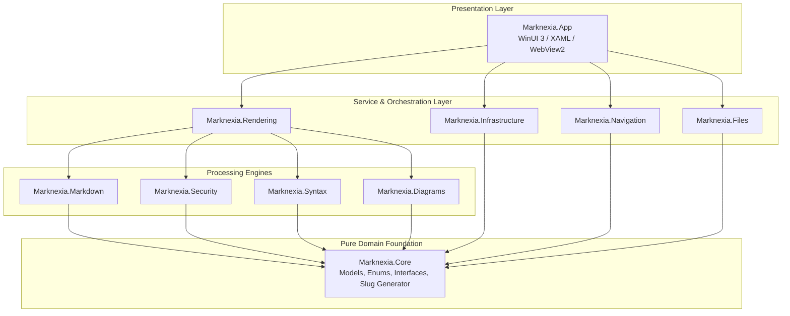

# Marknexia

<p align="center">
  
</p>

<p align="center">
  <strong>Read. Explore. Understand.</strong><br>
  <em>GitHub-style Markdown. Native on Windows.</em>
</p>

<p align="center">
  
  
  
  
</p>

---

## Overview

Implementation is feature-complete at the source/test level; final native
WinUI/WebView2 interaction and signed-release acceptance are still in progress.
The feature list below describes the product scope, not a completed native
acceptance audit. See the
[completion plan and verification checkpoints](docs/superpowers/plans/2026-09-06-marknexia-completion.md)
for tested behavior and remaining gaps, including native interaction coverage,
signed packaging, and production-release update validation.

**Marknexia** is a high-performance, offline-first native Windows Markdown viewer and repository documentation browser. Built with **C# 13**, **.NET 10**, and **WinUI 3 (Windows App SDK)**, it faithfully reproduces GitHub-rendered Markdown semantics without cloud round-trips, web wrappers, or external CDN dependencies.

Engineered specifically for developers, technical architects, and engineering teams, Marknexia resolves the common frustrations of reading documentation repositories locally: broken relative links, non-functional repository-root `/` paths, unresponsive cross-file anchors, missing offline diagrams, and sluggish browser rendering.

---

## Key Features

### 1. GitHub-Flavored Markdown (GFM)
* **GitHub Alert Callouts**: Native rendering of `[!NOTE]`, `[!TIP]`, `[!IMPORTANT]`, `[!WARNING]`, and `[!CAUTION]` blockquotes with authentic GitHub Primer iconography, colors, and border accents.
* **Deterministic Heading Anchors**: GitHub-identical heading slug generation (`#heading-title`, duplicate suffixing `-1`, `-2`, unicode handling, punctuation stripping).
* **Extended GFM Extensions**: Full support for GitHub-flavored tables, task lists with checkboxes, strikethrough, autolinks, footnotes, and custom containers.
* **Dual Theme Engine**: GitHub Light and GitHub Dark Primer token palettes that automatically adapt to your Windows system preference or user override.

### 2. Offline-First Diagrams & Math
* **Bundled Mermaid Runtime**: Pre-packaged Mermaid 11.4 engine executing locally in an isolated DOM boundary—zero network requests.
* **Rich Diagram Types**: Flowcharts, Sequence Diagrams, State Diagrams, Class Diagrams, Entity Relationship (ER) diagrams, and Gantt charts.
* **Interactive Diagram Containers**: Built-in "Copy Source" and "Toggle Source / Diagram" controls, with friendly fallback error boundaries for malformed diagram syntax.
* **Mathematical Typesetting**: Common LaTeX delimiters render as local semantic HTML
  (`<sup>`, `<sub>`, fractions, roots, and Greek/operator symbols) with no KaTeX CDN
  or runtime dependency.

### 3. Resilient Repository Navigation Engine
* **Intra-Document Navigation**: Instant smooth scrolling to internal heading anchors (`#anchor-name`).
* **Relative Cross-File Links**: Seamless resolution of sibling and subfolder documents (e.g., `./docs/setup.md`, `../architecture/adr-001.md`).
* **Cross-Document Anchors**: Direct navigation across files with fragment targeting (e.g., `./api.md#authentication`).
* **Repository-Root Paths**: Absolute links prefixed with `/` (e.g., `/docs/overview.md`) automatically resolve relative to the detected repository root (`.git` boundary marker).
* **Navigation History**: Complete browser-grade `Back` and `Forward` history stacks with forward-pruning on branch navigation.
* **Directory Traversal Sandboxing**: Strict canonical path validation prevents hostile documents from escaping the workspace root (e.g., `../../../../Windows/System32`).

### 4. Modern WinUI 3 Desktop Shell
* **Multi-Document Tabs (`TabView`)**: Open, reorder, close, and navigate multiple markdown files simultaneously.
* **Hierarchical Outline Sidebar (`TreeView`)**: Real-time document outline automatically extracted from headings (`H1`–`H6`) for instant jumping.
* **Repository Workspace Explorer**: Sidebar tree view of all documentation files within the opened repository or workspace folder.
* **In-Page Search (`Ctrl+F`)**: Instant text search with match highlighting, match count indicators, and keyboard navigation (`Enter` / `Shift+Enter`).
* **Windows Shell Integration**: Manifest file associations for `.md`, `.markdown`, `.mdown`, and `.mkdn`, with Windows App SDK file-activation handling and command-line fallback.

### 5. Enterprise-Grade Security & Performance
* **Sanitized DOM Execution**: Powered by `Ganss.Xss` (`HtmlSanitizer`). Proactively strips `<script>`, `javascript:` URIs, inline DOM event handlers (`onload`, `onerror`, `onclick`), `<object>`, `<embed>`, `<iframe>`, and malicious SVGs.
* **Protocol Whitelisting**: Strict protocol restriction permitting only `file:`, `http:`, `https:`, and `mailto:`.
* **Bounded Two-Level Caching**: In-memory source and rendered-document caches keyed by file freshness, content hash, document authority, theme, feature policy, and renderer configuration for safe tab switching.
* **Universal Encoding Detection**: Asynchronous file reader with automatic Byte Order Mark (BOM) sniffing supporting UTF-8, UTF-16 LE/BE, and UTF-32.

---

## Architecture & Layering

Marknexia enforces a strictly decoupled 10-layer architecture. Domain models, navigation logic, and parsing adapters remain pure .NET 10 libraries with **zero** UI or platform dependencies, ensuring exceptional testability and portability.



### Solution Project Directory

| Project | Responsibility | Dependencies |
| :--- | :--- | :--- |
| **`Marknexia.Core`** | Domain records (`MarkdownDocument`, `HeadingItem`, `NavigationTarget`), interfaces, and `HeadingSlugGenerator`. | Pure .NET 10 |
| **`Marknexia.Files`** | `PathCanonicalizer`, encoding-aware `FileService`, and `.git`-detecting `RepositoryService`. | `Marknexia.Core` |
| **`Marknexia.Navigation`** | `NavigationResolver` (classifications, traversal sandboxing) and `NavigationHistoryManager`. | `Marknexia.Core`, `Marknexia.Files` |
| **`Marknexia.Markdown`** | `MarkdigParserAdapter` (GFM pipeline, alerts transformation, heading extraction, Mermaid block isolation). | `Marknexia.Core`, `Markdig` |
| **`Marknexia.Syntax`** | `ColorCodeSyntaxHighlighter` (offline pure C# syntax highlighting). | `Marknexia.Core`, `ColorCode.HTML` |
| **`Marknexia.Diagrams`** | `MermaidDiagramRenderer` (DOM container wrappers, error boundaries, action triggers). | `Marknexia.Core` |
| **`Marknexia.Security`** | `HtmlSanitizerService` (Ganss.Xss sanitizer with allowlist, script and event-handler stripping). | `Marknexia.Core`, `HtmlSanitizer` |
| **`Marknexia.Rendering`** | `TemplateEngine`, `MarkdownRenderer`, embedded CSS tokens, offline Mermaid runtime, and WebView2 bridge. | `Marknexia.Core`, Engines |
| **`Marknexia.Infrastructure`** | `DocumentCache` (LRU memory cache) and `SettingsService` (JSON settings persistence). | `Marknexia.Core` |
| **`Marknexia.App`** | WinUI 3 desktop shell, XAML controls, TabView, sidebars, search bar, and MSIX packaging. | Windows App SDK, Services |

---

## Keyboard Shortcuts

| Shortcut | Action | Scope |
| :--- | :--- | :--- |
| `Ctrl + O` | Open file via system file picker | Global |
| `Ctrl + Shift + O` | Open repository / folder workspace | Global |
| `Ctrl + T` | Open a file picker for a new document tab | Application Shell |
| `Ctrl + W` | Close current tab | Application Shell |
| `Ctrl + Tab` | Switch to next tab | Application Shell |
| `Ctrl + Shift + Tab` | Switch to previous tab | Application Shell |
| `Ctrl + F` | Open in-page search bar | Document Viewer |
| `Enter` (in search) | Find next occurrence | Search Bar |
| `Shift + Enter` (in search) | Find previous occurrence | Search Bar |
| `Escape` (in search) | Dismiss search bar | Search Bar |
| `Alt + Left Arrow` | Navigate back in history | Document Viewer |
| `Alt + Right Arrow` | Navigate forward in history | Document Viewer |
| `Ctrl + R` / `F5` | Reload current document | Document Viewer |

The **File**, **View**, **Settings**, and **Help** menus expose open/close, sidebar, reload, keyboard help, About, update-check, and explicit remote-image controls. Remote images remain blocked by default; enabling the Settings toggle persists the choice and reloads the active document.

## Support and Supply-Chain Transparency

Marknexia includes an offline-safe branded About dialog, keyboard-oriented self-help, recent-file recovery, and drag-and-drop support for Markdown files and repository folders. The viewer itself has no runtime CDN dependency; update checks and network-image access are explicit user actions.

Rendering is cancellation-aware and offloads parsing, highlighting, diagram
transformation, math, and sanitization away from the WinUI thread. To avoid
unbounded DOM allocation, source documents larger than 50 MiB are rejected with
an actionable in-app diagnostic; rendered HTML is capped at 128 MiB, while
Mermaid is capped at 64 diagrams and 1 MiB per diagram source with accessible
source fallbacks for disabled or over-limit diagrams.
Repository tree scans are cancellable worker operations and attach their native
hierarchy only after the filesystem walk completes.

Generate the repository SBOM after restore with:

```powershell
.\scripts\Generate-Sbom.ps1 -OutputPath artifacts/marknexia-sbom.spdx.json
```

The generator reads the application's restored `src/Marknexia.App/obj/project.assets.json`, excluding unrelated test projects. It records resolved NuGet packages (including build dependencies across restored target frameworks/RIDs), package URLs, available SHA-512 hashes, transitive dependency relationships, and the bundled Mermaid file's SHA-256. Unknown license and download-origin data stays `NOASSERTION`; this is not a complete inventory of files in the installed Windows runtime.

PowerShell 7 is required. App builds generate `marknexia-sbom.spdx.json` beside the executable, and publish copies it into the publish directory. ZIP/MSIX packaging includes that file. **Help → Software components (SBOM)** displays component versions and can copy the complete SPDX JSON. Use `-ProductVersion` to identify a specific release; standalone generation otherwise uses the restored project version. Set `SOURCE_DATE_EPOCH` to a fixed Unix timestamp for byte-for-byte reproducibility; without it, generation uses the current UTC time. Each distinct document gets a content-derived namespace.

Run the offline regression checks with `./scripts/Test-Sbom.ps1`. To also validate against the [official SPDX 2.3 JSON schema](https://raw.githubusercontent.com/spdx/spdx-spec/v2.3/schemas/spdx-schema.json), supply its local path using `-SchemaPath`. Checks cover relationship integrity, project exclusion, package and bundled-file hashes, dependency edges, deterministic generation, and missing restore inputs.

Self-update is implemented as an explicit stable-release flow for portable x64 and
ARM64 builds: the menu checks trusted GitHub assets for the running architecture,
verifies the SHA-256 sidecar, validates the required executable/assembly/PRI/SBOM
payload, stages the ZIP with traversal/size limits, and starts a rollback-capable
restart worker. It requires a release containing the exact architecture-specific
package/checksum assets; signed MSIX and Store-managed update paths remain separate
release concerns.

---

## Getting Started

### Prerequisites
* **Operating System**: Windows 10 version 19041 (20H1) or later, or Windows 11.
* **Developer SDK**: [.NET 10 SDK](https://dotnet.microsoft.com/download/dotnet/10.0) (10.0.100 or newer).
* **Shell**: PowerShell 7 (`pwsh`) for build and SBOM scripts.
* **IDE / Build Tools**: Visual Studio / Build Tools with .NET 10 support and the following components:
  * *.NET Desktop Development*
  * *Windows App SDK C# Templates*
  * Windows 10/11 SDK and Windows app development packaging/PRI build tasks.

### Cloning & Building

1. **Clone the repository**:
   ```bash
   git clone https://github.com/ramanacr/marknexia.git
   cd marknexia
   ```

2. **Restore dependencies**:
   ```bash
   dotnet restore Marknexia.slnx
   ```

3. **Build the Windows application**:
   ```powershell
   pwsh -NoProfile -File ./scripts/Build-App.ps1 -Configuration Release -Platform x64 -NoRestore
   ```

   The script selects a Visual Studio MSBuild installation with PRI packaging tasks and verifies the executable, generated `Marknexia.App.pri`, and bundled SBOM. `dotnet build` alone may lack these Visual Studio tasks. Do not disable PRI generation to work around a missing toolchain: the result can build but fail at startup. Use `-Rebuild` for a clean rebuild or `-Platform ARM64` for that build target (ARM64 runtime verification requires an ARM64 Windows host).

4. **Run automated unit and integration tests**:
   ```bash
   dotnet test Marknexia.slnx
   ```

### Running the Application

#### Option A: Install via MSIX Package (Recommended)
Download the signed package from the [Latest Release](https://github.com/ramanacr/marknexia/releases/latest):
* **`Marknexia-v<version>-win-x64.msix`**
* **`Marknexia-v<version>-win-arm64.msix`** on ARM64 Windows devices.
* For developer sideloading, sign the locally generated package with a developer certificate trusted on the target machine; no development certificate is distributed in this repository.

#### Option B: Portable Standalone Distribution
Download the architecture-matching **`Marknexia-v<version>-win-x64.zip`** or
**`Marknexia-v<version>-win-arm64.zip`**, extract anywhere, and launch
`Marknexia.App.exe`.

#### Option C: Windows Self-Installer
Download the architecture-matching **`Marknexia-v<version>-win-x64-setup.exe`** or
**`Marknexia-v<version>-win-arm64-setup.exe`**. The first-party installer is
self-contained, installs per-user without elevation, creates the Start Menu
shortcut and Markdown file associations, and registers a clean uninstaller.
The installer and its SHA-256 sidecar are produced by
[`scripts/Build-Installer.ps1`](scripts/Build-Installer.ps1). On ARM64 Windows,
use the ARM64 installer; on x64 Windows, use the x64 installer.

The local `scripts/prepare-store-package.ps1` output is unsigned and intended for package-layout verification; it is not a Store-installable release until signed and validated by the release pipeline.

#### Option C: Local Developer Run
To launch directly from the local build output:
```powershell
.\src\Marknexia.App\bin\x64\Release\net10.0-windows10.0.19041.0\Marknexia.App.exe .\README.md
```
Or open `Marknexia.slnx` in Visual Studio and press **F5**.

---

## Navigation & Anchor Resolution Logic

Marknexia's `NavigationResolver` categorizes and handles every link target deterministically:

| Target Link Example | Classification | Resolution Strategy |
| :--- | :--- | :--- |
| `#installation-guide` | `IntraDocumentAnchor` | In-page JavaScript scroll to element with ID `installation-guide`. |
| `./getting-started.md` | `RelativeMarkdownFile` | Resolved relative to current document directory; opens in active/new tab. |
| `../api/overview.md#auth` | `CrossDocumentAnchor` | Resolves target file path, loads document, scrolls to `#auth` on render. |
| `/docs/architecture.md` | `RepositoryRootFile` | Resolves against the `.git` root folder rather than drive root. |
| `https://github.com/` | `ExternalWeb` | Safe handoff to the user's default Windows web browser (`Process.Start`). |
| `../../../../secret.txt` | `Unsupported` (Sandbox) | Traversal attempt blocked; safe error diagnostic presented to user. |

---

## Security Model

Marknexia treats local markdown files as untrusted input. Documentation from public Git repositories could contain malicious HTML or SVG payloads:

| Attack Vector | Defense Mechanism | Implemented By |
| :--- | :--- | :--- |
| **Arbitrary JavaScript** | Strips `<script>`, `eval()`, `vbscript:`. | Ganss.Xss `HtmlSanitizerService` |
| **Inline Event Handlers** | Attributes matching `on*` (`onload`, `onerror`, `onclick`) removed. | `HtmlSanitizerService` |
| **Dangerous Schemes** | Protocols restricted to `file:`, `http:`, `https:`, `mailto:`. Blocks `javascript:`, `data:`. | `NavigationResolver` & `HtmlSanitizer` |
| **Malicious SVG Payloads** | Script elements inside inline `<svg>` blocks stripped. | `HtmlSanitizerService` |
| **Path Traversal Escapes** | `PathCanonicalizer.IsWithinRoot()` validates target paths against workspace root. | `PathCanonicalizer` |
| **Data Exfiltration** | Offline-bundled styles and scripts; remote images stay blocked by default and require an explicit setting. | `MarkdownRenderer` and WebView2 resource broker |

---

## Automated Test Suite

Run the .NET regression suite from the repository root:

```powershell
dotnet test Marknexia.slnx --configuration Release
```

The [headless browser suite](tests/Marknexia.Bridge.Tests/README.md) verifies the
actual document bridge's search, copy, diagram-source, and link behavior under
Chromium. It runs separately from `dotnet test`; CI and release builds run both.

The 2026-09-09 local checkpoint recorded **131 .NET tests** and **18 headless Chrome
tests** passing with zero failures/skips. This does not establish complete feature
coverage, native WebView2/WinUI behavior, signed MSIX installation, or production
release/update readiness.

### Test Fixtures
Located in [`test-fixtures/markdown/`](file:///d:/Practice/marknexia/test-fixtures/markdown):
* `navigation/`: Multi-document hierarchy testing relative links, cross-file anchors, and repo-root `/` paths.
* `diagrams/`: Mermaid syntax fixtures testing sequence diagrams, flowcharts, and syntax error fallback boundaries.
* `gfm/`: Tables, checklists, footnotes, autolinks, and GitHub alert callouts.
* `security/`: Hostile markdown suite containing XSS injections, encoded event handlers, and traversal sequences.

---

## Packaging & Microsoft Store Readiness

The current developer distribution is a self-contained portable Windows build. An unsigned Store-layout MSIX can be generated from the latest Release output with `scripts/prepare-store-package.ps1`; signing, WACK validation, and Store submission remain release-pipeline responsibilities:
* **Package Manifest**: [`Package.appxmanifest`](file:///d:/Practice/marknexia/src/Marknexia.App/Package.appxmanifest) configured with identity `RRCLabs.Marknexia`, capabilities (`runFullTrust`), and file type associations (`.md`, `.markdown`, `.mdown`, `.mkdn`).
* **Visual Assets**: Complete suite of square logos, wide logos, splash screens, and application icons (`16x16` through `512x512`, `.ico`) generated from the official brand assets.
* **Store Metadata**: Marketing descriptions, feature bullets, and brand alignment documented in [`branding-docs/brand/STORE-COPY.md`](file:///d:/Practice/marknexia/branding-docs/brand/STORE-COPY.md).

For reproducible local package verification, run:

```powershell
pwsh -NoProfile -File ./scripts/prepare-store-package.ps1
pwsh -NoProfile -File ./scripts/Test-MsixPackage.ps1
```

`prepare-store-package.ps1` runs this verifier automatically. The verifier checks the package identity, selected architecture/version, required executable/PRI/SBOM payloads, and MakeAppx unpackability. It does not claim a signing certificate, Windows App Certification Kit (WACK), or Microsoft Store approval; those checks belong to the release pipeline.
Pass `-Platform ARM64` to package the ARM64 Release output; the script writes a separate `Marknexia-Store-Ready-ARM64.msix` and verifies an `arm64` manifest identity.

---

## Brand Notice

*Marknexia* is an independent, native Windows documentation viewer. "GitHub" and the GitHub Octocat logo are registered trademarks of GitHub, Inc. Marknexia is not affiliated with, endorsed by, or sponsored by GitHub, Inc. The term "GitHub-style" is used solely to describe the rendering syntax and behavioral compatibility of Markdown documents.

---

## License

This project is licensed under the [MIT License](LICENSE).

