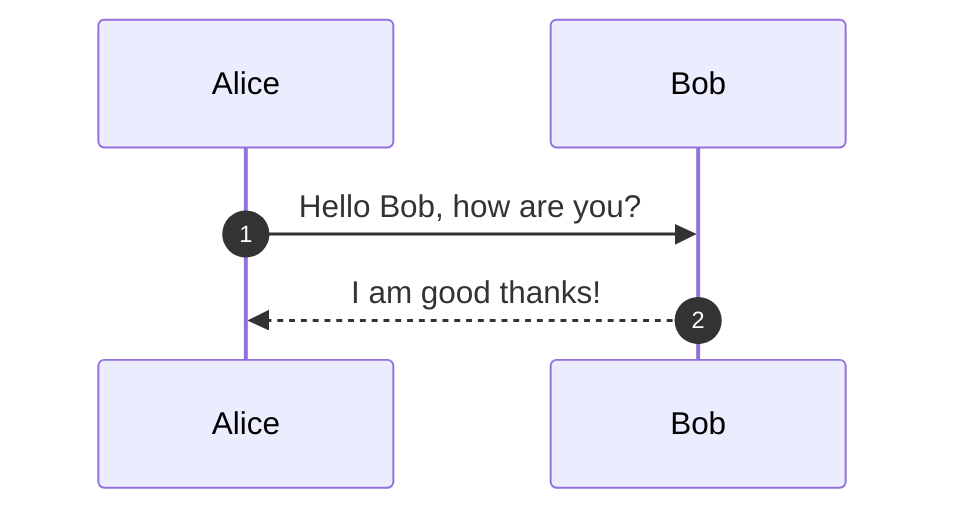
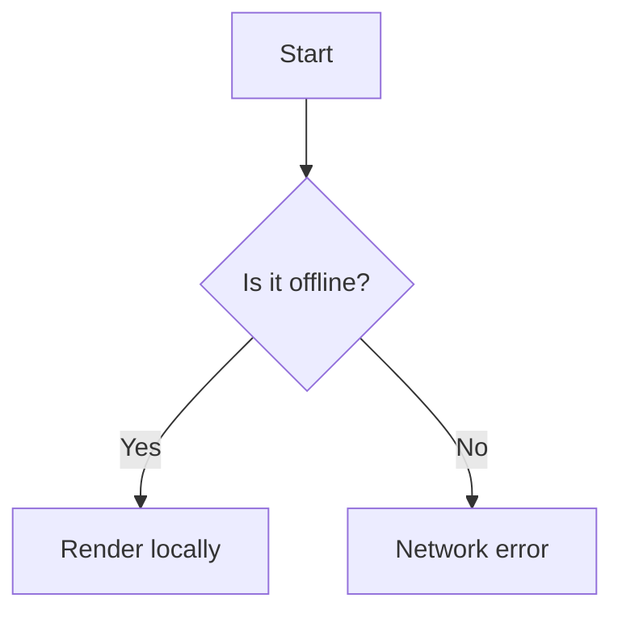

# Mermaid Diagrams Test

Here is a valid sequence diagram:

```mermaid
sequenceDiagram
    autonumber
    Alice->>Bob: Hello Bob, how are you?
    Bob-->>Alice: I am good thanks!
```

Here is a flowchart:

```mermaid
graph TD
    A[Start] --> B{Is it offline?}
    B -- Yes --> C[Render locally]
    B -- No --> D[Network error]
```

Here is a diagram with intentional syntax error:

```mermaid
invalid mermaid syntax here
```
